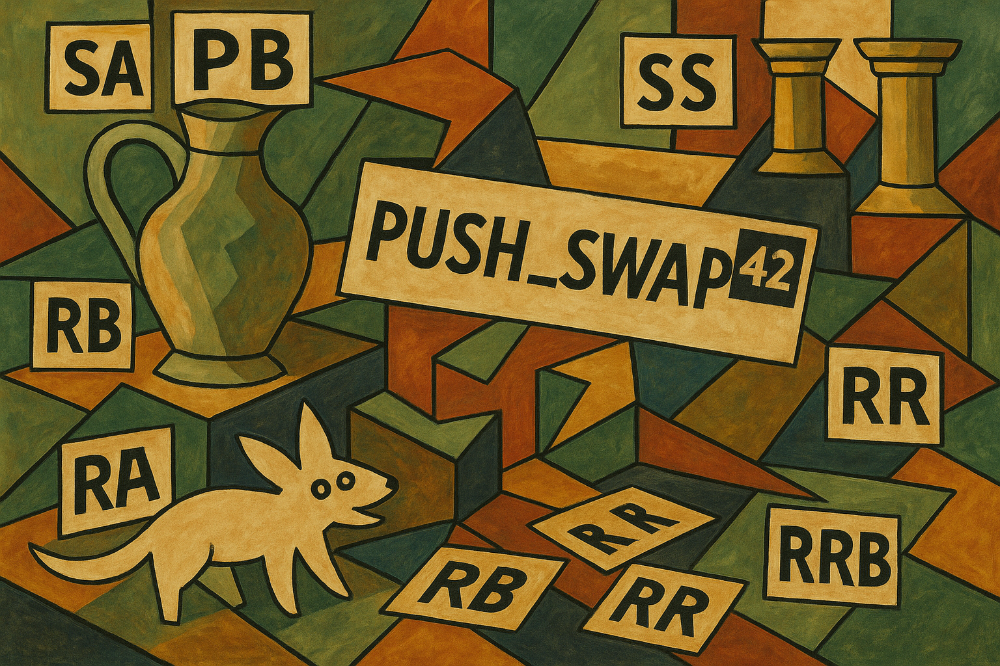

|          Grade           |                           |
|:------------------------:|:-------------------------:|
|  |  |

<br>

---

<details>
<summary>🇫🇷 FRENCH VERSION</summary>

<p align="center">
    Ceci est un <a href="./subject/push_swap.en.subject.pdf">projet</a> de l'école 42 (réalisé en mars 2024).
</p>

## Préambule
Le but est d’écrire un programme en C qui `trie une pile d'entiers` à l’aide d’un ensemble limité d’instructions (`sa`, `pb`, `ra`, etc.), tout en minimisant le nombre d’opérations nécessaires.

## Compétences:
- Algorithmes de tri optimisés
- Manipulation de structures de données (listes chaînées)
- Gestion de la complexité algorithmique
- Parsing et gestion des erreurs en ligne de commande

## Installation
```bash
git clone https://github.com/N0fish/push_swap.git
cd push_swap
make
```

## Utilisation
```bash
./push_swap 3 2 1
```
push_swap : génère la liste d’instructions pour trier une pile.

</details>

---

<details>
<summary>🇬🇧 ENGLISH VERSION</summary>

<p align="center">
    This is a <a href="./subject/push_swap.en.subject.pdf">project</a> from 42 school (completed in March 2024).
</p>

## Preamble
The goal is to write a C program that `sorts a stack of integers` using a limited set of operations (`sa`, `pb`, `ra`, etc.), while minimizing the number of moves.

## Skills:
- Efficient sorting algorithms
- Linked list manipulation
- Algorithmic complexity analysis
- Robust command-line parsing and error handling

## Installation
```bash
git clone https://github.com/N0fish/push_swap.git
cd push_swap
make
```

## Usage
```bash
./push_swap 3 2 1
```
push_swap: generates a list of instructions to sort the stack.

</details>

---

<details>
<summary>🇷🇺 RUSSIAN VERSION</summary>

<p align="center">
    Это <a href="./subject/push_swap.en.subject.pdf">проект</a> из школы 42 (выполнен в марте 2024 года).
</p>

## Преамбула
Цель — написать программу на C, которая `сортирует стек целых чисел` с помощью ограниченного набора команд (`sa`, `pb`, `ra` и т.д.), минимизируя количество операций.

## Навыки:
- Реализация и оптимизация алгоритмов сортировки
- Работа со связными списками
- Анализ сложности алгоритмов
- Обработка ввода и ошибок из командной строки

## Установка
```bash
git clone https://github.com/N0fish/push_swap.git
cd push_swap
make
```

## Использование
```bash
./push_swap 3 2 1
```
push_swap: выводит инструкции для сортировки стека.

</details>

---

<br>
